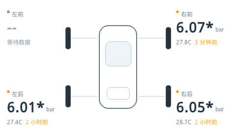
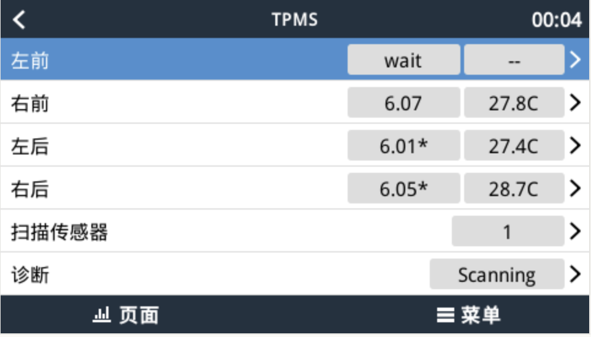

# venus-tpms-ble

BLE TPMS integration for Victron Venus OS / GX devices.

The runtime is a static native Rust service.

It adds a `TPMS` page to the GX device list, where you can discover BLE tire
pressure sensors and bind them to four wheel positions.

## Dashboard



## TPMS Page



[中文说明](README.zh-CN.md) | [Detailed guide](docs/USAGE.md)

## Compatibility

Verified on Venus OS `v3.55` running on a Color Control GX (`armv7`). Other
versions are not yet verified; the installer always starts with a protected
trial before any permanent change.

## Install

Enable [SSH / root access](https://www.victronenergy.com/live/ccgx:root_access),
SSH into the GX device, and run:

```sh
wget -O - https://raw.githubusercontent.com/jkqq147/venus-tpms-ble/master/install.sh | sh
```

The installer starts a temporary trial and reloads only the GX UI. Check the
`TPMS` page on the local screen, then type `CONFIRM` in the SSH terminal to keep
the installation. Any other input restores the original UI.

## Use

1. Open `TPMS` in the GX device list.
2. Wait for a sensor in `Discovered`.
3. Open it and assign its `Wheel` position.

## Reboot and Update

Normal GX reboots start TPMS automatically. After **every Venus OS update**, run
the install command again and complete the trial: the update replaces the GX UI
files that provide the TPMS menu.

## Uninstall

```sh
wget -O - https://raw.githubusercontent.com/jkqq147/venus-tpms-ble/master/uninstall.sh | sh
```

For display meanings, Bluetooth diagnostics, troubleshooting, and development,
see the [detailed guide](docs/USAGE.md).
